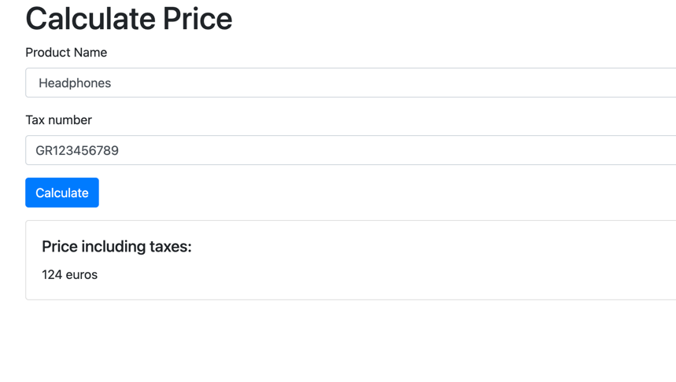

# Price calculator app with Symfony 5.4 and Docker

## Getting Started

1. If not already done, [install Docker Compose](https://docs.docker.com/compose/install/) (v2.10+)
2. Run `docker compose build --pull --no-cache` to build fresh images
3. Run `docker compose up` (the logs will be displayed in the current shell)
4. Open `https://localhost` in your favorite web browser 
5. Run `docker compose down --remove-orphans` to stop the Docker containers.

An example of product price calculation by tax code `GR123456789` where `GR` belongs to `Greece` country tax code.

## PS:
if you have problem with database data please run these commands inside `app_php` container:

`php bin/console doctrine:migrations:migrate`

`php bin/console doctrine:fixtures:load`

## License

Symfony Docker is available under the MIT License.
